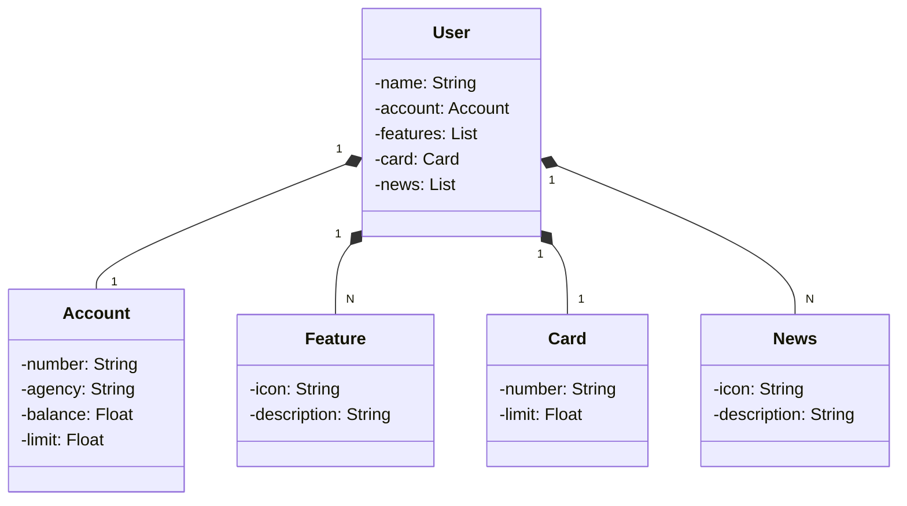

# Api Java Domínio Bancario
## 📖 Introdução

O projeto "Api Java Domínio Bancário" é uma aplicação que se concentra na manipulação de requisições HTTP por meio de uma API Rest. Ele oferece a funcionalidade de realizar operações Get (obter informações) e Create (criar) para contas bancárias, que incluem dados como nome, número da conta, informações do cartão, funcionalidades e atualizações. A arquitetura desse projeto segue um modelo de três camadas: Controller (ponto de entrada da API), Service (onde ocorre a validação de dados e lógica de negócios) e Repository (responsável pelo armazenamento no banco de dados), garantindo o tratamento adequado dos dados desde a entrada até o banco de dados.

Além disso, essa aplicação oferece uma interface web acessível por meio do Spring Web, permitindo a realização de requisições HTTP sem a necessidade de um aplicativo externo.

Os conteúdos principais a serem explorados são:

- Programa Orientado a Objeto (POO);
- Pilares de POO;
- Springboot Framework (spring Data JPA, spring Security, outras bibliotecas);
- API Rest;

## 🔗Link de Acesso

- Documentação: Em Processo...

## Diagrama de Classes:



## Funcionalidades

```bash
. Crud de clintes:
  - POST: Criar um domínio bancário informando seu nome, conta, cartão, features e novidades.
  - GET: Podendo acessar a contas existentes via email.
  - PUT: Atualizar os valores por meio de um ID existente. -> EM PROCESSO...
  - DELETE: Deletar contas. -> EM PROCESSO...
```

## 💡Programas utilizados:

- VSCode

## 💻Tecnologias


## 📫 Contato

<p>Email: italo.rocha.de.oliveira@gmail.com</p>

<a href = "mailto:italo.rocha.de.oliveira@gmail.com"></a>
<a href="https://www.linkedin.com/in/italorochaoliveira/" target="_blank"></a>
